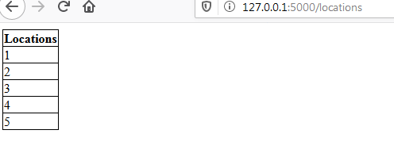

# Inventory Management Web App

### Results 

1. route : localhost:5000

  a.Index
    
  
  b.Location Input Error
    

  c.Successful Input
    
    
    
2. route : localhost:5000/products 

   View Products 
  
   
     
3. route : localhost:5000/locations

   View Locations 
  
   
   
   
4. route : localhost:5000/movements

   View Product Movements
  
   
   
   
5. route : localhost:5000/edit

    Delete 
    
    
    
    
    
 6. route : localhost:5000/report
    
     
    
    
    
